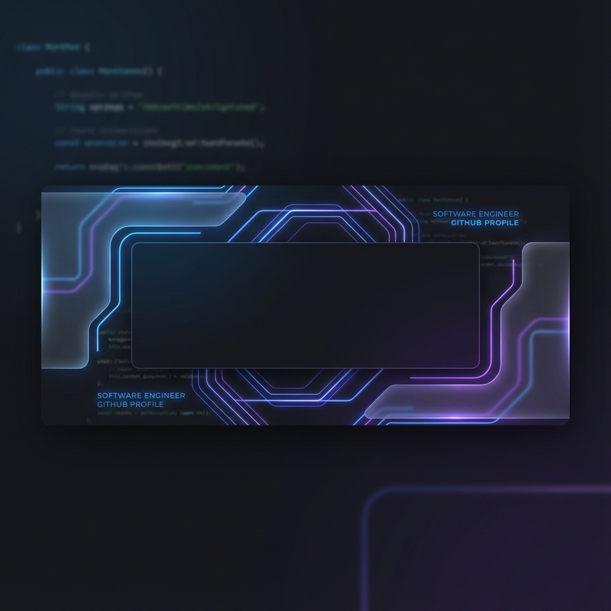

# 👋 Hi, I'm Alvee (@Alvee0033)

### 🚀 About Me
I'm a passionate Software Engineer and AI Enthusiast, currently focused on building interactive web applications and exploring advanced computer vision techniques. I love creating seamless user experiences and integrating cutting-edge AI models into production-ready platforms.

- 🔭 Currently working on: **Face Tracking Web Application**
- 🌱 Learning: **Advanced Pose Estimation and 3D Model Rendering**
- 💬 Ask me about: **Next.js, Python, MediaPipe, and UI/UX Design**
- 📫 REACH ME: [LinkedIn](https://www.linkedin.com/in/alvee0033)

---

### 🛠️ Tech Stack & Tools

  
  
  
  
  
  
  
  
  
  

---

### 📊 GitHub Stats

  
   
  
   
  

---

### 🏆 Featured Projects
- [**Face Tracking Web**](https://github.com/Alvee0033/face-tracking-project): A real-time face tracking application using MediaPipe and Next.js.
- [**Aidx Medical App**](https://github.com/Alvee0033/aidx-medical-app): A comprehensive medical assistant platform built with Flutter and Firebase.

---

  <i>"Code is like humor. When you have to explain it, it’s bad."</i>

