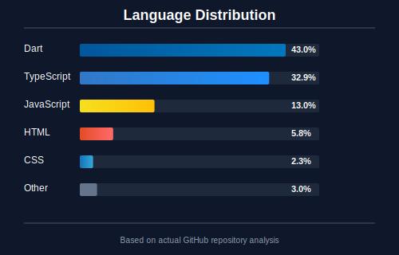

  

    

  

      
      
      
      
  

  
  

      
  

 

## ⚡ SYSTEM STATUS: ONLINE

I'm a **Fullstack Developer** and **AI/ML Specialist** from **Bangladesh 🇧🇩**. 
Building the future, one commit at a time.

  

 

## 🛠️ ARSENAL

### LANGUAGES

  

### STACK

  

### BACKEND_CORE

  

### INTELLIGENCE

  

### UTILITIES

 

## 📊 DATA_STREAM

  

 

## 🐍 CONTRIBUTION_SEQUENCE

  

 

## 🎯 OBJECTIVES_2025

- [ ] 🚀 **Open Source**: Major contributions.
- [ ] 📱 **Mobile**: Publish production Flutter app.
- [ ] 🧠 **AI**: Master LLMs & Transformers.
- [ ] ☁️ **Cloud**: AWS Solutions Architect.
- [ ] 📝 **Share**: Technical Blogging.

 

  
INITIATED BY [ALVEE](https://github.com/Alvee0033)

