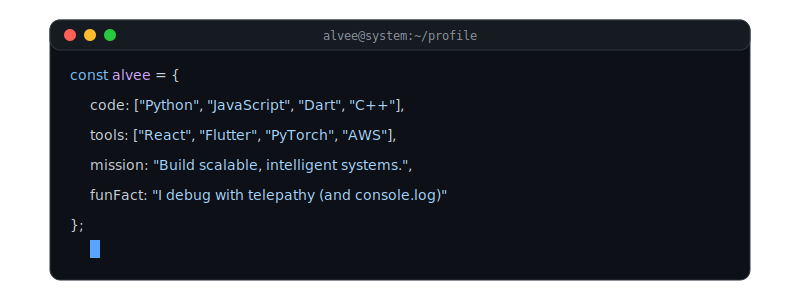

  

    

  

      
      
      
      
  

  
  

      
  

---

## About Me

I'm a **Fullstack Developer** and **AI/ML Specialist** from Bangladesh, passionate about building innovative solutions and contributing to the open-source community. Currently focused on full-stack development, machine learning, and cloud technologies.

  

---

## Technical Stack

### Programming Languages

  

### Frontend & UI

  

### Backend & Databases

  

### AI & Machine Learning

  

### Tools & Infrastructure

  

---

## GitHub Statistics

  
  &nbsp;
  

### Contribution Activity

  

---

## 2025 Goals & Roadmap

| Goal | Description |
|------|-------------|
| **Open Source** | Make significant contributions to major open-source projects |
| **Mobile Development** | Deploy production-ready Flutter application to app stores |
| **AI Mastery** | Deep dive into LLMs, Transformers, and advanced ML architectures |
| **Cloud Architecture** | Achieve AWS Solutions Architect certification |
| **Technical Writing** | Build personal blog with in-depth technical articles |

---

  

    <strong>Let's collaborate and build something amazing together</strong>
  

  
  <a href="https://github.com/Alvee0033">
    <strong>View My GitHub Profile</strong>
  </a>

