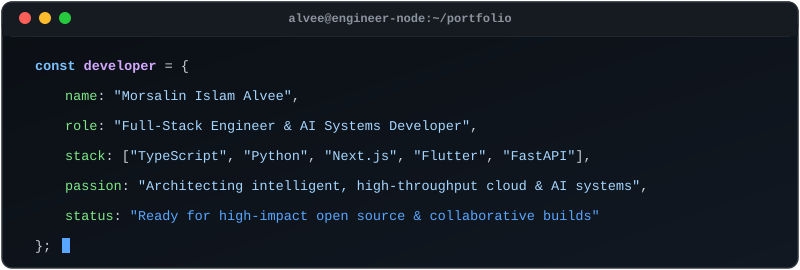
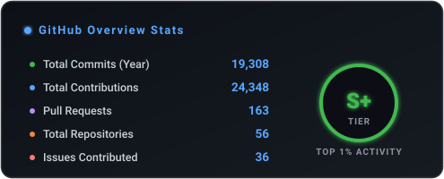
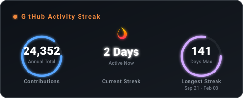
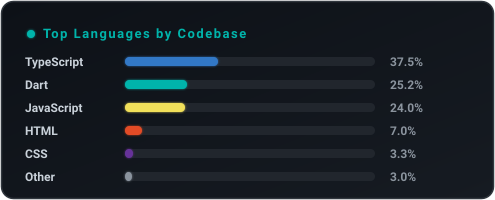

  

    

  

    
    
    
    
  

  
  

    
    
  

---

### 👨‍💻 About Me

I am a **Full-Stack Engineer** and **AI/ML Specialist** dedicated to architecting scalable applications, intelligent computer vision systems, and performant web/mobile experiences. Passionate about open source, modern system architecture, and cloud infrastructure.

  

---

### 🚀 Featured Repositories

| Project | Tech Stack | Highlights |
|:---|:---|:---|
| [**🫁 Pneumonia Detection AI**](https://github.com/Alvee0033/pneumonia-detection-ai) | `Python` `TensorFlow` `FastAPI` | Medical imaging classification API with 89.6% accuracy and Grad-CAM visual heatmaps. |
| [**📚 Edu Course Platform**](https://github.com/Alvee0033/edu-course-platform) | `Dart` `Flutter` `NestJS` | High-performance study discovery platform with cross-platform UI and modular backend. |
| [**🤖 ESP32 Line Follower**](https://github.com/Alvee0033/esp32-line-follower) | `C++` `FreeRTOS` `PID Control` | Autonomous robotics navigation with real-time encoder feedback and multi-junction path planning. |
| [**📊 MangoDB Dashboard**](https://github.com/Alvee0033/mangodb-dashboard) | `Next.js` `TypeScript` `MongoDB` | Full-featured SaaS operations console with auth, project management, and live task tracking. |

---

### 🛠️ Technical Arsenal

<b>⚡ Languages & Core Technologies</b>

 

  

 

<b>🎨 Frontend & Mobile Frameworks</b>

 

  

 

<b>⚙️ Backend, APIs & Databases</b>

 

  

 

<b>🧠 AI, Machine Learning & Computer Vision</b>

 

  

 

<b>☁️ DevOps, Cloud & Developer Tools</b>

 

  

---

### 📊 GitHub Intelligence & Activity

  
  &nbsp;
  

 

  

---

### 🐍 Contribution Activity

  

---

### 🎯 2026 Engineering Goals

- 🌐 **Full-Stack & Microservices**: Architect distributed cloud services using NestJS, FastAPI, and Kubernetes.
- 🤖 **Applied AI & LLMs**: Build domain-specific multi-agent workflows, fine-tuned models, and real-time vision pipelines.
- 📱 **Mobile Innovation**: Ship feature-packed, reactive Flutter applications to production with continuous delivery.
- 🌟 **Open-Source Impact**: Expand contributions across high-impact open-source developer tooling.

---

  

    <strong>Let's collaborate and build something extraordinary</strong>
  

  

    
    &nbsp;
    
  

